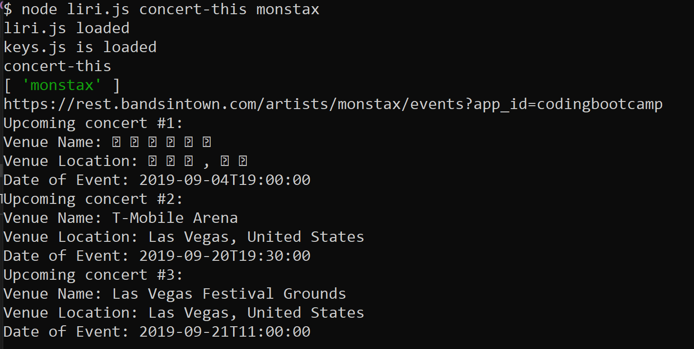
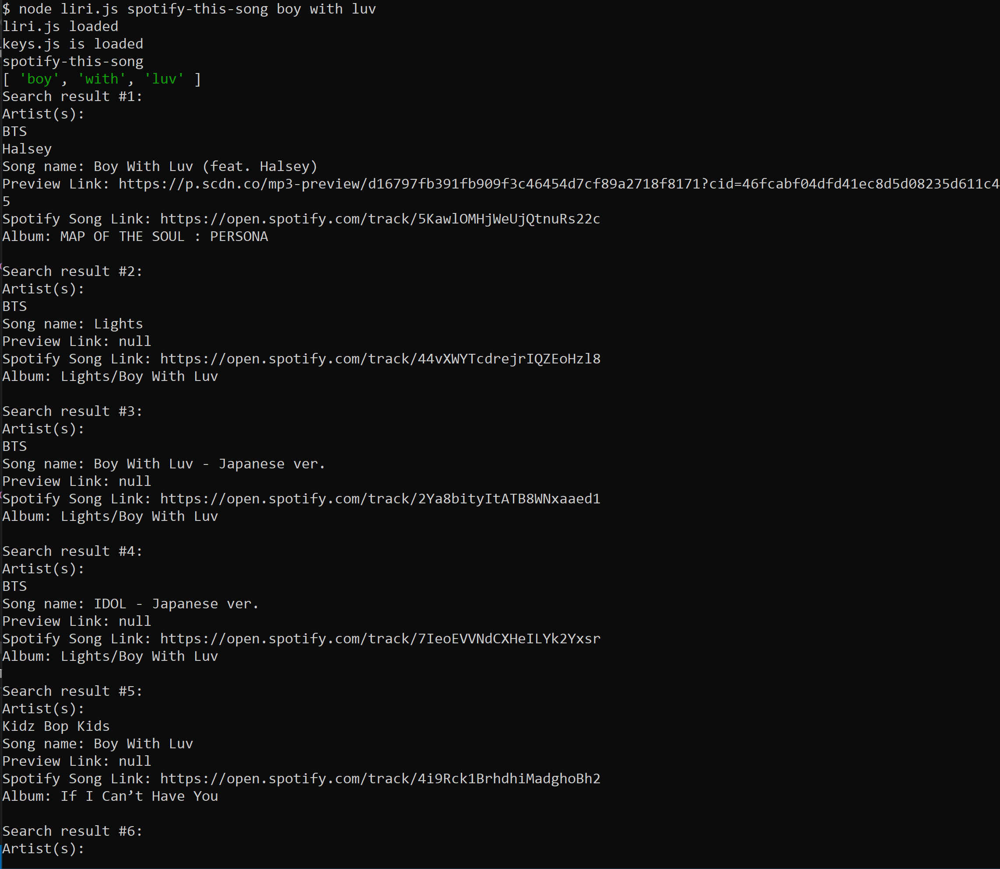
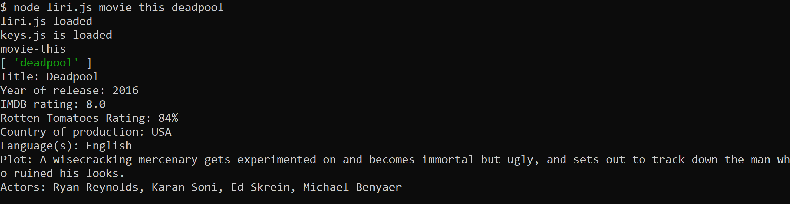
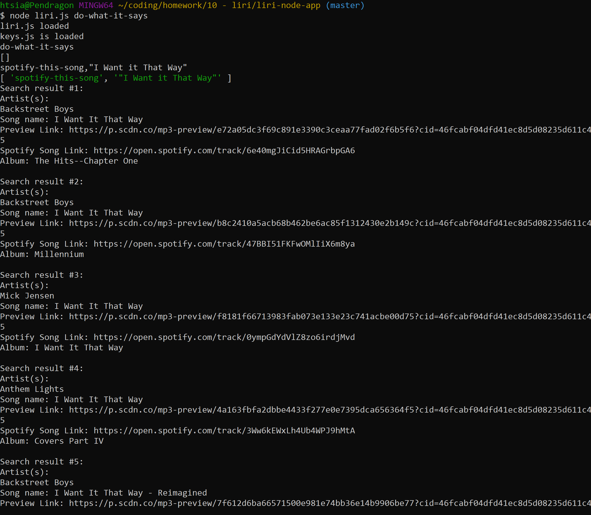

# LIRI APP #

This CLI accepts 4 commands. The commands are formatted as "node liri.js (command) (search item)" on the CLI. The commands and what they do are as follows.

### 1st Command ###

Command: concert-this

Search Item: the name of a band/singer

API Called: Bands In Town

Function: When this command is used, the Bands In Town API is called with a search for the requested artist. The following information is output on the terminal for each upcoming concert:
1. Venue Name
2. Venue Location (City, Country)
3. Date of Concert/Event

Screenshot Example:

### 2nd Command ###

Command: spotify-this-song

Search Item: the title of a song

API Called: Spotify, using the node-spotify-api npm package

Function: When this command is used, the Spotify API is called with a search for the requested song title. The response is limited to 10 songs. The following information is output on the terminal for each song:
1. Artist(s)
2. Song Name
3. Preview for song
4. Spotify Song URL
5. Album

Screenshot Example:

### 3rd Command ###

Command: movie-this

Search Item: the title of a movie

API Called: OMDB

Function: When this command is used, the OMDB API is called with a search for the requested movie title. The response returns one movie. The following information is output on the terminal for the movie:
1. Title
2. Year of release
3. IMDB rating
4. Rotten Tomatoes Rating (not always given)
5. Country of production
6. Language(s)
7. Plot
8. Actors

Screenshot Example:

### 4th Command ###

Command: do-what-it-says

Function: This command utilizes the fs npm package to read the contents of the provided random.txt file. Inside the file, there is a command followed by a search item separated by a comma. The command is separated from the search item, and the two are re-inputed into the CLI function to determine which command was used and what API should be called.

Screenshot Example:
